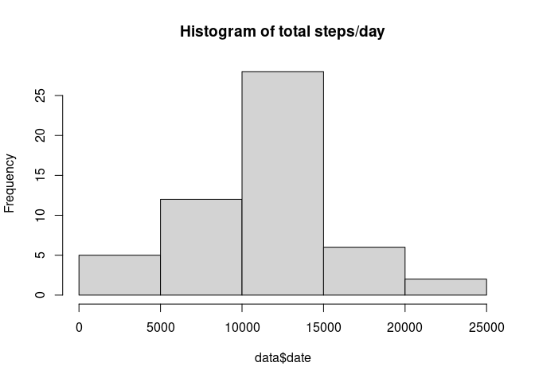
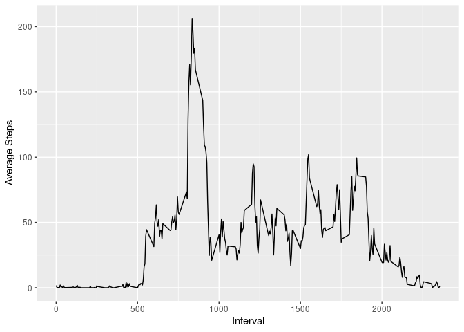
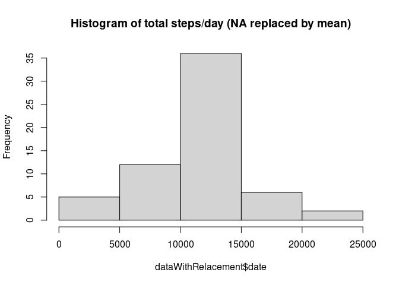
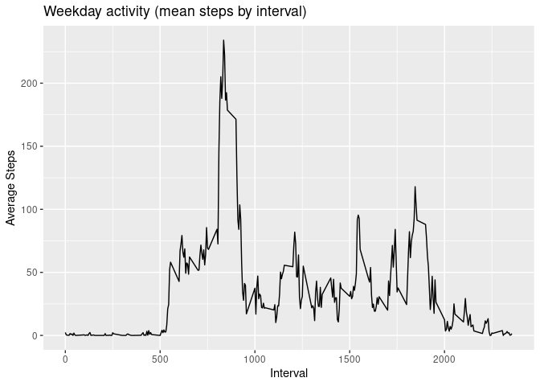
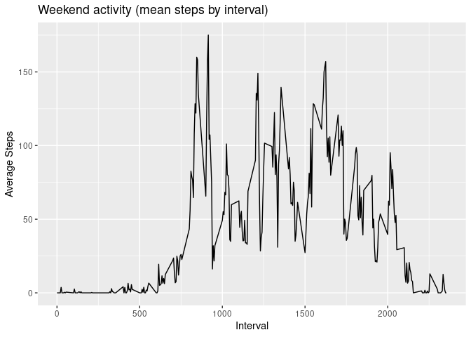

# Assignment Project 1  
## Loading and preprocessing the data


```r
data <- read.csv("/home/christopher/Documents/Coursera_Data_Science/datasciencecoursera/reproducible-research/RepData_PeerAssessment1/activity.csv", colClasses=c("numeric", "Date", "numeric"))
# process data

## add columns to index whether weekday or weekend - this is fot analyses at end project.
data$day <- weekdays(data$date)
data$weekday <- (data$day %in% c('Monday', 'Tuesday', 'Wednesday', 'Thursday', 'Friday'))
```

## What is mean total number of steps taken per day?
This is the histogram of total steps per day.  


```r
hist(tapply(data$steps, data$date, sum), main="Histogram of total steps/day", xlab = deparse1(substitute(data$date)))
```

<!-- -->


```r
## compute interval with max average number of steps
intervalSteps <- aggregate(data$steps, by=list(data$interval), mean, na.rm=TRUE)
maxIntervalSteps <- intervalSteps[intervalSteps['x'] == max(intervalSteps['x']),]
```
The Interval with the maximum average number of steps is: 835.  
Interval 835 has an average of 206.1698113 steps.

### Mean and median number of steps per day


```r
# remove na and 0 days
meanSteps <- mean(subset(data$steps, !(data$steps == 0), data$steps, na.rm = TRUE))
medianSteps <- median(subset(data$steps, !(data$steps == 0), data$steps, na.rm = TRUE))
```

The mean number of steps per day is: 134.2607059 steps.  
The median number of steps per day is: 56 steps.  

## What is the average daily activity pattern?


```r
library(ggplot2)
plotData <- aggregate(data$steps, list(data$interval), mean, na.rm=TRUE)
ggplot(plotData, aes(x=`Group.1`, y=`x`)) + geom_line() + xlab("Interval") + ylab("Average Steps")
```

<!-- -->


```r
count_NAs <- sum(is.na(data))
```

The total number of NA's in the dataset is: 2304  

## Imputing missing values

For steps and interval

```r
## replace NA in steps with mean of steps for whole sample and put into new dataset
dataWithRelacement <- data
dataWithRelacement$steps[is.na(data$steps)] <- mean(data$steps, na.rm=TRUE)
```

### Histograms with imputed values


```r
hist(tapply(dataWithRelacement$steps, dataWithRelacement$date, sum), main="Histogram of total steps/day (NA replaced by mean)", xlab = deparse1(substitute(dataWithRelacement$date)))
```

<!-- -->

## Are there differences in activity patterns between weekdays and weekends?


```r
## add a column to index if weekday or not added in 1st code block
weekData <- subset(data, data$weekday == TRUE)
weekendData <- subset(data, data$weekday == FALSE)
plotWeek <- aggregate(weekData$steps, list(weekData$interval), mean, na.rm=TRUE)
p1 <- ggplot(plotWeek, aes(x=`Group.1`, y=`x`)) + geom_line() + xlab("Interval") + ylab("Average Steps") + ggtitle("Weekday activity (mean steps by interval)") + xlim(0, max(data$interval))
plotWeekend <- aggregate(weekendData$steps, list(weekendData$interval), mean, na.rm=TRUE)
p2 <- ggplot(plotWeekend, aes(x=`Group.1`, y=`x`)) + geom_line() + xlab("Interval") + ylab("Average Steps") + ggtitle("Weekend activity (mean steps by interval)") + xlim(0, max(data$interval))
par(mfrow = c(2,1))
plot(p1)
```

<!-- -->

```r
plot(p2)
```

<!-- -->


